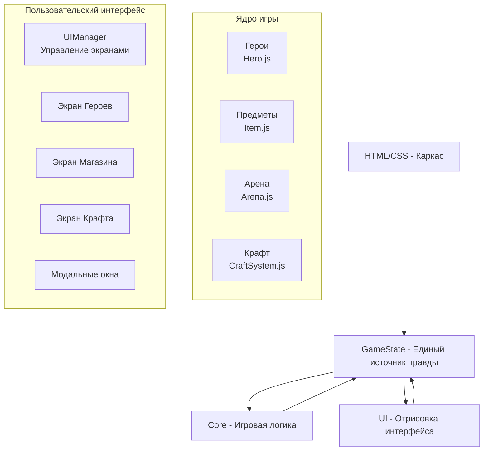

<br>
<div align="center">
  
  <h1>⚔️ Arena Survivors ⚔️</h1>
  <p><strong>Пошаговое создание игры на чистом JavaScript</strong></p>
  <p>Учебный проект по веб-разработке: от первого тега HTML до полноценного игрового цикла</p>
  <br>

  [](##-итерация-1-скелет-и-навигация)
  [](##-итерация-2-герои-и-пассивная-генерация)
  [](##-итерация-3-магазин-и-покупка-предметов)
  [](##-итерация-4-крафт-и-рецепты)
</div>
<br>

## 🎯 О проекте

**Arena Survivors** — это не просто игра. Это **интерактивный учебник** по веб-разработке, где каждый ученик становится полноценным разработчиком.

Мы не пишем код вслепую. Мы создаём модульную, расширяемую игру шаг за шагом, изучая на практике:
- **HTML/CSS** — адаптивная вёрстка без скроллов
- **JavaScript (ES6+)** — классы, модули, паттерны
- **ООП и SOLID** — единая ответственность, открытость/закрытость
- **Архитектуру** — разделение на ядро, UI и состояние
- **Командную работу** — Git, код-ревью, задачи

> 💡 **Главное правило**: игра работает с первого дня. Каждая итерация добавляет новый функционал, не ломая старый.

---

## 🏗️ Архитектура (с первого взгляда)

Всё, что нам нужно, умещается в одну схему:



**Проще говоря:**
- 🧠 **GameState** — мозг, хранит все данные.
- ⚙️ **Core** — мышцы, управляет логикой (бой, крафт, расчёты).
- 👁️ **UI** — лицо, показывает игру и ловит клики.

Никто не лезет в чужие дела. Core не знает про UI, UI только читает GameState.

---

## 📁 Структура проекта (живая и растущая)

```
arena-survivors/
│
├── 📄 index.html          # Точка входа (разметка, подключение скриптов)
├── 🎨 style.css           # Стилизация (адаптив, темы, сетки)
├── 📖 README.md           # Этот документ (навигатор по проекту)
│
├── 📁 js/
│   ├── 🎮 game.js         # Главный файл (собирает всё воедино)
│   │
│   ├── 📁 core/           # Игровая логика (не знает о UI)
│   │   ├── GameState.js    # Хранилище данных + пассивная генерация
│   │   ├── Hero.js         # Класс героя (уровень, инвентарь, экипировка)
│   │   ├── Item.js         # Предметы (оружие, броня, расходники, материалы)
│   │   ├── Shop.js         # Магазин (ассортимент, покупки)
│   │   ├── Arena.js        # [Скоро] Логика арены (бой, волны)
│   │   └── CraftSystem.js  # [Скоро] Крафт и рецепты
│   │
│   └── 📁 ui/             # Интерфейс (только отрисовка и события)
│       ├── UIManager.js     # Управление экранами, подписка на GameState
│       └── ...              # Каждый экран будет жить здесь
│
└── 📁 assets/             # [Позже] Звуки, изображения, шрифты
    ├── sounds/
    └── sprites/
```

> 📌 **Правило иерархии подключения**: `GameState` → `Core` → `UI` → `game.js`.  
> Нижние слои не знают о верхних.

---

## 🧠 Игровая механика (как это будет работать)

### 🎮 Герои (Hero)
- У каждого героя есть **уровень, опыт и характеристики** (HP, атака, защита, скорость).
- **Каждые 3 уровня** — выбор одного навыка из трёх случайных. Навык влияет на стиль игры.
- Герои **пассивно генерируют ресурсы** (провизия, топливо, инструменты) — чем больше героев, тем быстрее копится валюта.

### ⚔️ Бой (Arena)
- Запуск матча требует **1 единицу ресурса** (зависит от локации).
- На арене игрок **выживает** определённое время, убегая и атакуя врагов.
- Оружие ближнего боя — малый радиус, нет перезарядки. Дальнобойное — большой радиус, но требует перезарядки после каждого выстрела.
- В бою можно **использовать расходники** из инвентаря.
- После победы — **опыт, ресурсы, материалы**. Иногда — **новый рецепт**.

### 🏪 Магазин (Shop)
- Покупка предметов за **провизию**.
- Ассортимент обновляется (раз в день / раз в 30 секунд для теста).
- Цвета редкости: обычный (белый), редкий (синий), эпический (фиолетовый), легендарный (золотой).

### 🔨 Крафт (Craft)
- Создание предметов из **материалов** (древесина, железо, ткань и т.д.).
- Рецепты открываются за **получение навыков** героями или **редкие находки** в бою.
- Каждый скрафченный предмет можно надеть на любого героя.

### 💾 Сохранения
- Весь прогресс хранится в **localStorage**.
- Можно закрыть браузер, открыть снова — игра продолжится с того же места.

---

## 📱 Дизайн и адаптивность (никакого скролла страницы!)

Мы строим игру как **единый экран**, где всё помещается без прокрутки всего окна.  
Скроллятся только внутренние списки (герои, товары в магазине).

**Ключевые моменты:**
- `game-container` — флекс-колонка на всю высоту.
- `game-screen` — `flex: 1`, внутри `position: relative`.
- Все экраны переключаются через класс `active`.
- Медиазапрос для мобильных: `< 600px` — шапка становится колонкой.

```css
.game-container {
    display: flex;
    flex-direction: column;
    height: 100vh; /* Вся высота окна */
    max-height: 100vh;
    overflow: hidden; /* Никакого скролла страницы */
}

.game-screen {
    flex: 1;
    overflow-y: auto; /* Скролл только внутри */
}
```

---

## 🗺️ План итераций (дорожная карта)

Мы идём маленькими, но уверенными шагами. Каждая итерация — законченный функционал.

### ✅ **Итерация 1: Скелет и навигация**  
*База, на которой всё держится*
- [x] HTML-каркас (4 экрана: лобби, герои, магазин, крафт)
- [x] Базовая стилизация (тёмная тема, сетки)
- [x] Переключение экранов через нижнее меню
- [x] Глобальный `GameState` с ресурсами
- [x] Адаптивность (никаких скроллов страницы)

### ✅ **Итерация 2: Герои и пассивная генерация**  
*Появляется душа игры*
- [x] Класс `Hero` (уровень, опыт, инвентарь, экипировка)
- [x] Экран героев с карточками и выбором активного героя
- [x] Пассивная генерация ресурсов (каждый герой приносит +0.1/сек)
- [x] Модальное окно инвентаря
- [x] Тестовые расходники и их использование

### ✅ **Итерация 3: Магазин и предметы**  
*Экономика начинает работать*
- [x] Иерархия классов предметов (`Item`, `Weapon`, `Armor`, `Consumable`, `Material`)
- [x] Класс `Shop` с динамическим ассортиментом
- [x] Покупка предметов за провизию
- [x] Добавление купленных предметов в инвентарь героя
- [x] Таймер обновления магазина (30 сек для теста)

### 🔄 **Итерация 4: Крафт и рецепты** *(следующая)*
- [ ] Система крафта (`CraftSystem.js`)
- [ ] Экран крафта с доступными рецептами
- [ ] Проверка материалов и создание предмета
- [ ] Открытие новых рецептов (через навыки героев)

### ⏳ **Итерация 5: Боевая система (MVP)**
- [ ] Класс `Arena` (упрощённый бой: игрок vs 1 враг)
- [ ] Экран битвы с таймером и кнопками атаки
- [ ] Награды за победу (опыт, ресурсы, материалы)

### ⏳ **Итерация 6: Навыки и прокачка**
- [ ] Система навыков (выбор 1 из 3 при повышении уровня)
- [ ] Влияние навыков на характеристики
- [ ] Разблокировка новых героев за прохождение локаций

### ⏳ **Итерация 7: Полировка и сохранения**
- [ ] Сохранение/загрузка в `localStorage`
- [ ] Звуки и простые CSS-анимации
- [ ] Финальная настройка баланса
- [ ] Рефакторинг (проверка SOLID)

---

## 👥 Командная работа (как мы это делаем)

### Роли (можно меняться)
- **🧙 Core-мастер** — пишет логику героев, предметов, боя.
- **🎨 UI-художник** — создаёт экраны, стили, модальные окна.
- **💾 State-менеджер** — отвечает за GameState, подписки, сохранения.
- **🐛 Тестировщик** — ищет баги, проверяет крайние случаи.

### Процесс
1. **Выбрали задачу** из плана итераций.
2. **Создали ветку** `feature/название-фичи`.
3. **Написали код** (комментируем сложные моменты).
4. **Сделали код-ревью** — минимум один другой ученик проверяет.
5. **Влили в `develop`** после апрува.

### Code Style
- Классы — с большой буквы (`Hero`, `UIManager`).
- Методы — глаголы с маленькой буквы (`attack()`, `renderHeroes()`).
- Комментарии — JSDoc для публичных методов.

---

## 🎯 Задания для самостоятельной работы

*Эти задачи не входят в основной план, но делают игру интереснее. Бери любую!*

### 🌱 Новичок
1. **Счётчик времени** — покажи текущее время в шапке.
2. **Случайный цвет карточек** — лёгкий оттенок у каждого героя.
3. **Звук клика** — добавь `new Audio()` при нажатии кнопок.

### 🌿 Продолжающий
4. **Система достижений** — модуль `Achievements.js`, следит за событиями (накопил 100 ресурсов) и выдаёт награды.
5. **Дневная/ночная тема** — кнопка в шапке, переключает CSS-переменные.
6. **Сортировка инвентаря** — кнопки "По типу" / "По редкости".

### 🌳 Продвинутый
7. **Ежедневные задания** — "Проведи 3 матча в лесу", получи бонус.
8. **График прогресса** — Canvas с ростом уровня героя.
9. **Свои рецепты** — возможность комбинировать предметы и создавать новые рецепты.

---

## 🎉 Напутствие

Этот проект — **ваше портфолио**. Каждая строчка кода, каждая закрытая итерация — это шаг к уровню Junior Developer.

**Помните:**
- Не бойтесь ошибаться. Ошибки — лучший учитель.
- Если что-то непонятно — спросите наставника или товарища.
- Хотите добавить свою фичу? Создайте ветку и попробуйте!

Давайте создадим игру, в которую будет интересно играть, и код, который не стыдно показать на собеседовании. 🚀

---

<div align="center">
  <sub>Сделано с ❤️ для учеников, которые хотят стать настоящими разработчиками</sub>
  <br>
  <sub>📍 Актуальная версия: <strong>Итерация 3 (Магазин и предметы)</strong></sub>
</div>
